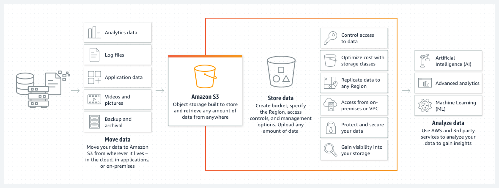

### 1. Identify a company: BBC 
 
The British Broadcasting Corporation (BBC) is a 100-year-old public service broadcaster that serves millions of people in the United Kingdom and around the world. The company has an expansive multimedia portfolio of television channels, radio networks, digital services, and news services.

## 2. What problems did they face?

The British Broadcasting Corporation (BBC) Archives Technology and Services team needed a modern solution to centralize, digitize, and migrate its 100-year-old flagship archives. The team wanted to merge its archives to enhance the preservability and accessibility of the media for future use.
 
### 3. How did the organization use AWS services to rectify the issue?

**Amazon S3**

Amazon Simple Storage Service (Amazon S3) is an object storage service that offers industry-leading scalability, data availability, security, and performance. You can use Amazon S3 to store and retrieve any amount of data at any time, from anywhere.

The team uses a combination of 
**Amazon S3 Glacier Instant Retrieval,** which is an archive storage class that delivers the lowest-cost storage for long-lived data that is rarely accessed and requires retrieval in milliseconds. By migrating its archives to AWS, the BBC optimized data accessibility, created cost efficiencies, freed up space used by physical infrastructure, and supported a transition into the future of archive preservation **and**

**Amazon S3 Intelligent-Tiering,** a cloud storage class that delivers automatic storage cost savings without performance impact or operational overhead. The BBC can choose between these two storage classes depending on its expected level of access without compromising on performance.

 Because the BBC had used AWS for its media asset processing system in the past, which housed about 3 PB of media, it had experience with Amazon S3 solutions. It was a practical next step to migrate to an AWS solution that could contribute to the longer-term preservation strategy. "We wanted a consistent approach to extract value from inconsistent datasets, create an authoritative single catalogue that matches the media, and drive value for our audiences,” says Mallon. “Using AWS, we can standardize storage for all of our content.

 Within 10 months, the team had transferred 25 PB of data out to the cloud.

**Services used**
1.Amazon S3
2. Amazon S3 Glacier Instant Retrieval
3.Amazon S3 Intelligent-Tiering
4. AWS Direct Connect

### Link to access entire success story: 
[Success story](https://aws.amazon.com/solutions/case-studies/bbc-s3-case-study/?did=cr_card&trk=cr_card)
