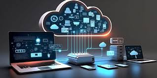

*REFERENCE FOR TASK: page 12 of Communication and STAR methodology topic under professional skills*

 # CLOUD FOUNDATIONS

 
The building block of the digital world 
-Applications
-Computers
-Network 

==**TYPES OF THE BUILDING BLOCKS**==
- Applications(web application,mobile app application, Internet of things etc)
- Components of a computer(Hardware(cpu,ram,hard disk) and software)
- Network- wired and wireless

==**CLOUD COMPUTING**==
Cloud computing is the delivery of computing services including servers, storage, databases, networking, software, analytics, and intelligence over the Internet. It enables on-demand access to shared resources, reducing the need for physical infrastructure.
Cloud concepts-like servers, data centres, virtual machines

==**AWS**== as a cloud service, their categories and services, infrastructure offer, their pricing and shared responsibility model

Some of the AWS services
==**S3**== and it's types and how they operate
==**EC2**==- operates like the CPU 

We did two Labs to see the AWS console and get a gist of how it looks like and also to understand the basic stuff of cloud computing from AWS perspective.

🅰️👥👥👥 **Group member names**🅰️👥👥👥
1. Tracy Opoku Afriyie
2. Rocio Perez Lopez
3. Zakariya Wiseman
4. Jude Alabi
5. Maureen Fischer-Wilmot
6. Iyabolatunji
