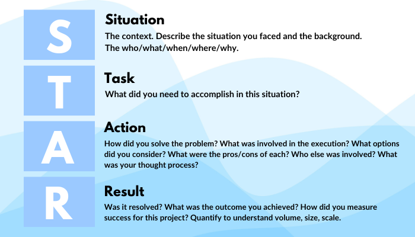

*REFERENCE FOR TASK: page 16 of Communication and STAR methodology topic under professional skills*

### STAR TECHNIQUE

S-Situation
T-Task
A-Action
R-Result

**Situation:**
In an AWS course and asked to to do a group work

**Task:**
A group work to present 
- On the do's and don't of online meeting, phone call and email
- Summarise our first week of class which was cloud foundations
-Use star technique to do our group work. 

**Action**
- We went into our groups, researched and discussed the work. We drafted the work and put it on markdown for presentation

**Result**
- We made our presnsetation and met the learning requirements for our assessment

🅰️👥👥👥 **Group member names**🅰️👥👥👥
1. Tracy Opoku Afriyie
2. Rocio Perez Lopez
3. Zakariya Wiseman
4. Jude Alabi
5. Maureen Fischer-Wilmot
6. Iyabolatunji

